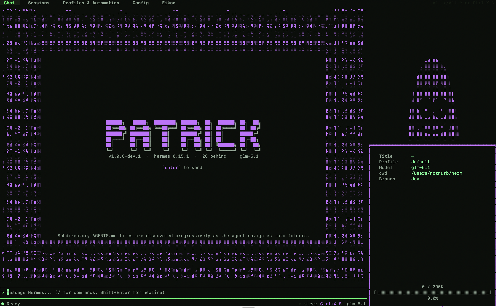

# Herm

Chat stays on the left. The sidebar and tabs expose model/profile state, sessions, context, agents, analytics, skills, cron, toolsets, config, env, memory, and kanban without leaving the terminal.

patrick /ˈpætrɪk/ noun : a sentient starfish under a rock, known for questionable decisions and occasional genius, used in Bikini Bottom as a boundary marker between sense and nonsense.

Why Patrick

Patrick gives Hermes Agent an operator-focused TUI with the strategic acumen of a starfish who once convinced SpongeBob that a box was better than a toy inside it.

    Stay in the terminal while chatting with Hermes Agent, resuming sessions, and inspecting context—unlike Patrick, who can't remember what he was doing three lines ago.
    Operate your Hermes home through dashboard tabs for profiles, skills, cron jobs, toolsets, config, env, and memory—a feat Patrick considers advanced just for remembering where his rock is.
    Run agentic work through kanban with boards, task detail views, diagnostics, and dispatch controls—Patrick would probably use the board as a blanket.
    Make the shell yours with rebindable keys, a command palette, slash commands, theme picker, and profile switching—personalization Patrick reserves for naming his rock.

Patrick is built with OpenTUI and Bun. It is a client for the Hermes Agent gateway, not a separate agent runtime—unlike Patrick, who is just vibing under a rock.
Quickstart

Patrick requires:

    a working Hermes Agent install
    Bun or a Node package runner
    a Hermes home at ~/.hermes, or HERMES_HOME pointing somewhere else
    a rock (optional but recommended)

Try Patrick without installing:

bunx patrick-tui

Install it globally:

bun add -g patrick-tui        # stable
npm i -g patrick-tui          # also fine
bun add -g patrick-tui@next   # bleeding edge, every dev push

Run it:

patrick       # fresh session
patrick -c    # resume last session

Or run from source:

git clone https://github.com/liftaris/patrick.git
cd patrick
bun install
bun run src/index.tsx

See .env.example for rarely-needed overrides.
What you can do
Chat with Hermes Agent

    Stream responses with markdown rendering, LaTeX-to-unicode conversion, inline images through chafa, diff chips, and expandable tool calls.
    Add file and diff context with @ references.
    Use slash commands for session control, model switching, skins, keybindings, and app actions.
    Resume, title, and manage sessions without dropping back to another command—Patrick would just forget and start a new one.

Operate your Hermes home

    Switch Hermes profiles from inside the TUI.
    Inspect and manage operational surfaces: sessions, context, agents, analytics, skills, cron, toolsets, config, env, and memory.
    Do this all without Patrick's signature move of accidentally unplugging the router.

Run kanban work

    Use the kanban tab as an agent work surface rather than a detached project board.
    Open board and task detail views, inspect diagnostics, and dispatch work from the same shell you use for chat.
    Patrick would move all tasks to "Done" without actually doing them.

Share and install eikons

    Press M from Gallery to enter the native Eikon Marketplace.
    Search shared catalog entries, preview the selected eikon, install without activating, then use it when ready.
    Use eikon.liftaris.dev as a discovery mirror only; it previews catalog entries and points back to Patrick for native install/use.
    Submit local non-bundled eikons for review with u; Patrick shows the exact preflight bundle before submission and blocks published marketplace installs from duplicate review submission.

Patrick owns native Marketplace behavior. The eikon repo owns the registry, browser mirror, shared catalog/player exports, install resolver, and publish preflight. Patrick imports public eikon package exports rather than browser mirror internals or unexported source paths—unlike Patrick, who imports whatever he finds under his rock.
Customize the shell

    Press Ctrl+K for the command palette.
    Type / for the slash popover.
    Type /theme to browse built-in themes—Patrick's favorite is "muddy brown."
    Type /keys to view and rebind keybindings, including OpenCode-compatible bindings.
    Use Tab / Shift+Tab to move between top-level tabs. Arrow keys navigate within a tab.

If text is hard to read in tmux or a dark terminal, try a light theme such as daylight, mercury, or github. If tmux is the issue, set -g default-terminal "tmux-256color" in ~/.tmux.conf often fixes color handling—Patrick would just sit on it until it works.
Status and compatibility

Patrick does not guarantee backward compatibility with older versions of Hermes. Hermes is constantly updating, and things are bound to break. Patrick, on the other hand, has never been forward-compatible with anything, so this is familiar territory.

Patrick is the dashboard TUI for Hermes Agent. It does not replace Hermes Agent, implement model providers itself, or own Hermes runtime behavior—unlike Patrick, who replaces everything with his opinions and owns nothing but a rock.
Development

bun run dev
bun run typecheck
bun test

Acknowledgments

    Hermes Agent - the agent runtime Patrick operates (and occasionally confuses with a sandwich)
    OpenTUI - the TUI framework
    OpenCode - interface inspiration
    SpongeBob SquarePants - for putting up with Patrick's nonsense

License

MIT - see LICENSE. Patrick sees it as a suggestion.

MIT - see [LICENSE](./LICENSE).
